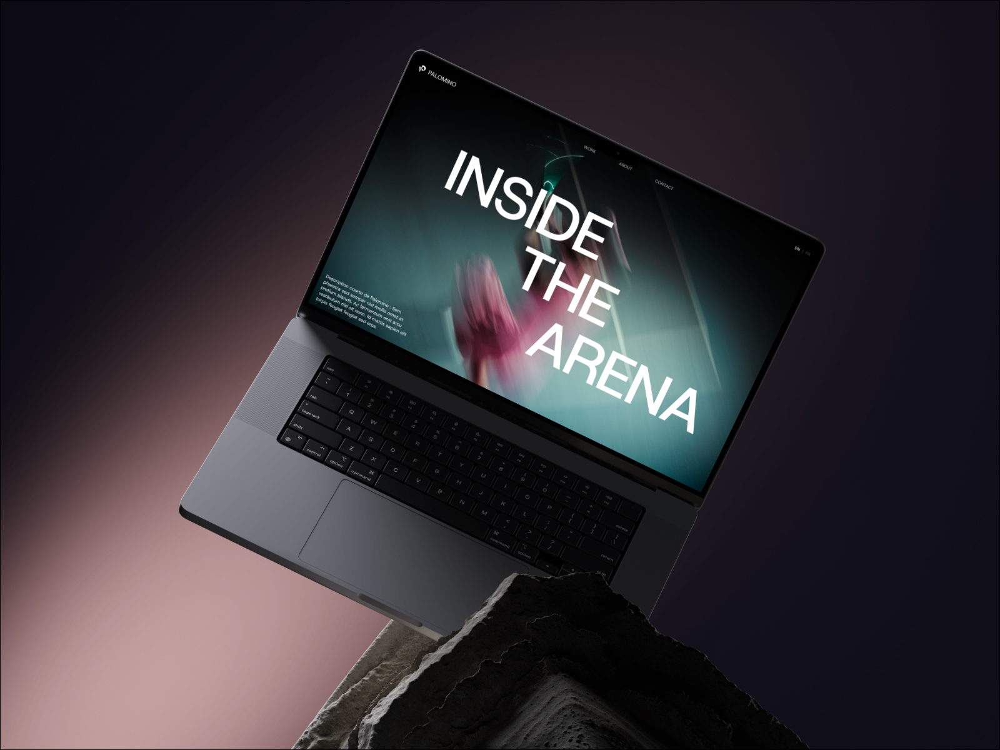

# ⚡ PALOMINO — Sports Film & Photography Studio

> Turning brand campaigns and athlete journeys into stories worth remembering. Frame by frame.



---

## 🌟 Overview

**PALOMINO** is a high-impact, state-of-the-art Web Application showcasing a premium sports film and photography studio based in Paris & Barcelona. Engineered with modern front-end web technologies, custom WebGL interactive shaders, smooth inertia scrolling, and dynamic kinetic typography animations.

---

## ✨ Key Features

- 🎨 **Cinematic Visual Aesthetic**: Sleek dark-mode aesthetic with custom typography (`Gilroy-Medium` & `Poppins-Light`).
- 🌊 **Interactive WebGL Ribbon Canvas**: Fluid, multi-threaded WebGL ribbon particle cursor overlay powered by `ogl`.
- ⚡ **Page Intro Loader**: Custom smooth percentage counter with expanding circular mask animation.
- 📜 **Interactive Stacking Cards**: Dynamic smooth-scrolling card stack powered by `lenis` scroll physics for studio services.
- 🎞️ **Selected Projects Showcase**: Responsive media grid featuring high-definition video loops and photo galleries with smooth hover scale effects.
- 📐 **KPVerse Sliding Navigation Menu**: Interactive full-screen menu drawer rendered via React Portals with character shuffling text effects.
- 🔁 **Client Marquee**: 360-degree seamless infinite logo carousel displaying global partner brands.
- 💬 **Testimonial Slider**: Interactive testimonial carousel with smooth transition logic.
- 📊 **Key Figures Count-Up**: Animated statistics counters triggered upon viewport intersection using Motion.

---

## 🛠️ Technology Stack

| Category | Technology |
| :--- | :--- |
| **Framework** | [React 19](https://react.dev/) + [TypeScript](https://www.typescriptlang.org/) |
| **Build Tool** | [Vite 8](https://vitejs.dev/) |
| **Styling** | [Tailwind CSS v4](https://tailwindcss.com/) |
| **Animations** | [Motion](https://motion.dev/) |
| **WebGL Graphics** | [OGL](https://github.com/oamap/ogl) |
| **Smooth Scroll** | [Lenis](https://lenis.darkroom.engineering/) |
| **Icons** | [Lucide React](https://lucide.dev/) |
| **Code Quality** | [Oxlint](https://oxc.rs/) |

---

## 📁 Directory Structure

```
Palomino/
├── public/
│   └── favicon.svg           # Brand favicon icon
├── src/
│   ├── assets/               # Media assets (videos, WebP images, client logos & fonts)
│   │   ├── clients/          # Partner & brand logo PNGs
│   │   ├── fonts/            # Local Gilroy & Poppins font binaries
│   │   ├── images/           # Studio & service section photography
│   │   ├── hero.webp         # Hero section background image
│   │   ├── project-preview.jpg # Project showcase preview image
│   │   ├── 1.mp4             # High-definition showcase video 1
│   │   └── 2.webm            # High-definition showcase video 2
│   ├── components/           # React UI Components
│   │   ├── Carousel.tsx      # Infinite client marquee carousel
│   │   ├── Footer.tsx        # Studio footer with video-masked text
│   │   ├── FtrTop.tsx        # Pre-footer callout section
│   │   ├── Hero.tsx          # Kinetic hero typography section
│   │   ├── KeyFigures.tsx    # Impact statistics grid
│   │   ├── KPVerseMenu.tsx   # Interactive slide-over navigation menu
│   │   ├── Navbar.tsx        # Header navigation bar
│   │   ├── PageLoader.tsx    # Initial page loading screen
│   │   ├── Projects.tsx      # Portfolio media layout
│   │   ├── Services.tsx      # Stacking services cards layout
│   │   ├── Story.tsx         # Studio narrative section
│   │   └── Testimonials.tsx  # Interactive client review slider
│   ├── utils/                # Helper utilities & interactive engines
│   │   ├── CountUp.tsx       # Intersection observer number counter
│   │   ├── Ribbons.tsx       # WebGL fluid ribbon shader engine
│   │   └── ScrollStack.tsx   # Lenis card stack controller
│   ├── App.tsx               # Main application component layout
│   ├── main.tsx              # Application entry point
│   └── index.css             # Global styles & Tailwind import
├── index.html                # Main HTML entry document
├── package.json              # Project dependencies and script declarations
├── tsconfig.json             # TypeScript root configuration
└── vite.config.ts            # Vite bundler configuration
```

---

## 🚀 Quickstart & Development

### Prerequisites

Ensure you have Node.js (version 18 or higher) installed on your system.

### 1. Install Dependencies

```bash
npm install
```

### 2. Start Local Development Server

```bash
npm run dev
```

The application will be accessible at `http://localhost:5173`.

### 3. Build for Production

```bash
npm run build
```

The compiled distribution bundle will be output to the `dist/` directory.

### 4. Preview Production Build

```bash
npm run preview
```

---

## 📄 License

Created for **Palomino Studio**. All rights reserved.
